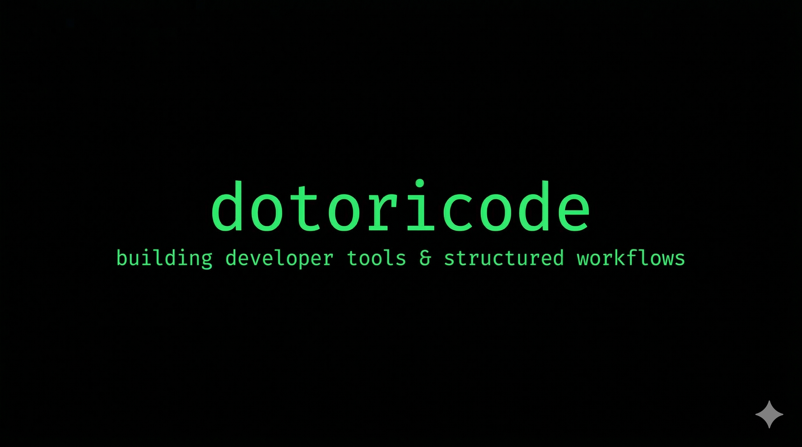

# dotoricode

Building developer tools and structured workflows.

## 🚀 Main Project

- **bkit-doctor**  
  CLI tool for structured workflow management inspired by bkit

## ⚙️ Focus

- developer tooling
- workflow systems
- AI-assisted development (Claude Code)

## 🔄 Current Work

- improving recommendation & init flow
- designing structured project systems
- experimenting with AI-assisted workflows

## 🧪 Philosophy

Design systems that scale with development workflows.
Keep things simple, structured, and extensible.
