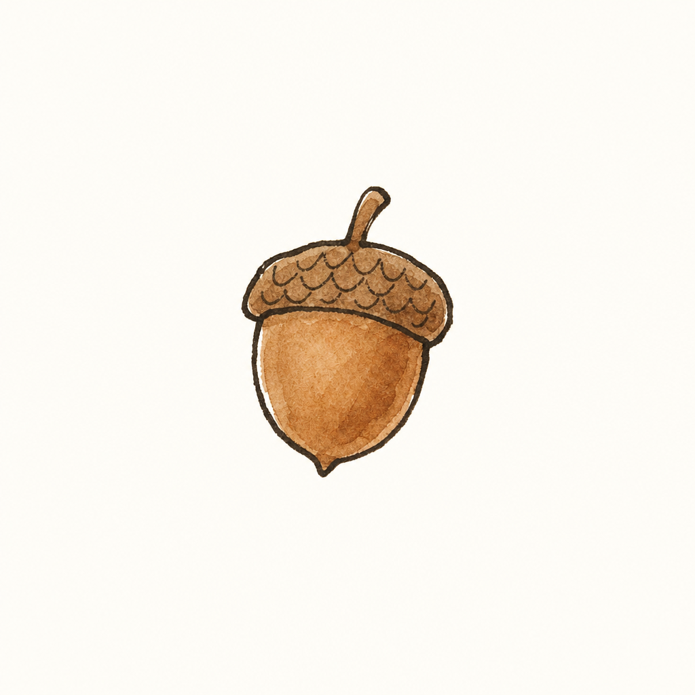

  

# Hi, I'm dotori

I build small, practical systems that make software work clearer, safer, and more repeatable.

**dotori** means acorn. I look like one.

I care about tools that reduce repeated mistakes, create calm workflows, and help people trust what their software is doing.

## Currently exploring

- Harness-driven development workflows
- Better tools for AI-assisted coding
- Practical software for real work

## Principles

- Small surface area
- Clear defaults
- Lightweight guardrails
- Reversible decisions
