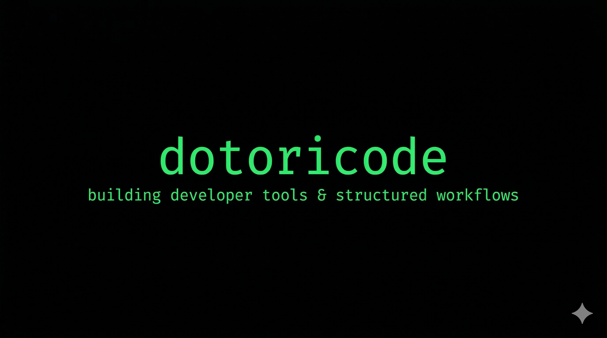

# dotori @ acorn-labs

I build small AI office systems for solo builders.

Right now I'm turning Hermes Desktop into the control room for acorn-labs, my one-person company. The setup brings agents, skills, memory, cron jobs, wiki notes, and mistake logs into one desktop workspace.

## current focus

- Hermes Desktop as the acorn-labs office
- Korean and English writing that does not sound machine-made
- agent workflows with files, logs, diffs, tests, or status values behind them
- small tools for people who mostly work alone

## projects and experiments

- [hermes-desktop](https://github.com/dotoricode/hermes-desktop): an acorn-labs experiment by dotori, adapting Hermes Desktop into a personal AI office
- [korean-humanizer](https://github.com/dotoricode/korean-humanizer): a Korean writing skill that removes the usual AI smell from generated text
- [cerberus](https://github.com/dotoricode/cerberus): a three-gate workflow for Claude Code: spec, plan, and intent
- [prompt-grill](https://github.com/dotoricode/prompt-grill): experiments around prompts, review, and better AI output
- [autonomous-flow-daemon](https://github.com/dotoricode/autonomous-flow-daemon): experiments in long-running autonomous agent workflows

## working style

I like tools that are boring, visible, and easy to check.

If an agent says it did something, I want a file, log, diff, test, or status value behind it.

## 한국어

나는 acorn-labs라는 이름으로 1인 창업자와 개발자를 위한 AI 사무실을 만들고 있습니다.

Hermes Desktop을 켜면 그날의 작업, 에이전트, 스킬, 정기 업무, 기록이 한곳에 모이는 구조를 실험하고 있습니다. 아직 멋진 제품이라기보다는 매일 직접 쓰면서 다듬는 운영 시스템에 가깝습니다.
