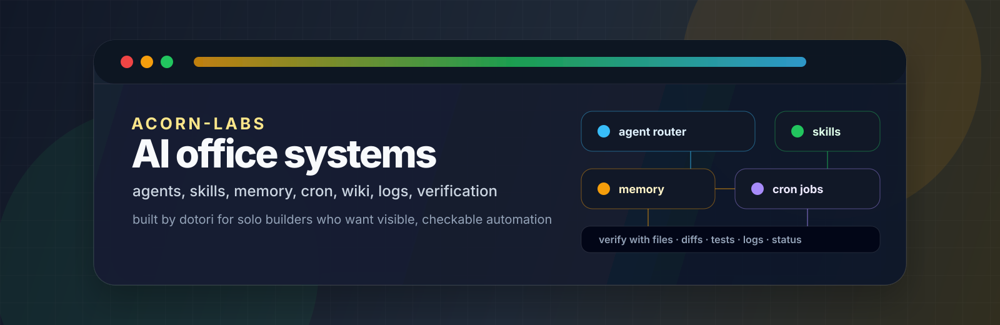

# dotori @ acorn-labs

I build AI office systems for solo builders.

The thing I keep coming back to: AI agents are useful only when their work is visible. If an agent says it changed something, I want a file, diff, log, test, or status value behind it.

Right now I am turning Hermes Desktop into the operating room for acorn-labs, my one-person company. The stack is simple on purpose: agents for execution, skills for repeatable work, cron for recurring jobs, memory for stable preferences, wiki notes for research, and mistake logs so the same failure hurts only once.

## Start here

- [korean-humanizer](https://github.com/dotoricode/korean-humanizer)
  - A small Korean writing skill for removing the usual AI smell from generated text. Useful if you publish in Korean and hate polished nonsense.
- [prompt-grill](https://github.com/dotoricode/prompt-grill)
  - Prompt and review experiments for getting cleaner output from coding agents.

## What I am building toward

- Agent workflows that leave evidence behind
- Korean and English writing tools that sound like a person wrote them
- Small utilities for people running mostly alone

## Working style

I prefer boring tools with clear outputs.

No magic dashboards unless they map back to files, logs, diffs, tests, or API state. No agent self-reports unless I can verify them. No giant process if a checklist and a cron job will do.

## 한국어

저는 acorn-labs라는 이름으로 1인 창업자와 개발자를 위한 AI 사무실을 만들고 있습니다.

Hermes 를 켜면 그날의 작업, 에이전트, 스킬, 정기 업무, 기록이 한곳에 모이는 구조를 실험하고 있습니다. 아직 완성된 제품이라기보다는 매일 직접 쓰면서 다듬는 운영 시스템에 가깝습니다.

관심 있는 저장소가 있으면 README를 먼저 보고, 쓸 만해 보이면 star나 follow로 표시해 주세요. 어떤 실험이 더 공개할 가치가 있는지 판단하는 데 도움이 됩니다.

## Links

- GitHub: [dotoricode](https://github.com/dotoricode)
- Blog: [blog.naver.com/vide03](https://blog.naver.com/vide03)
- Company handle: `acorn-labs`
